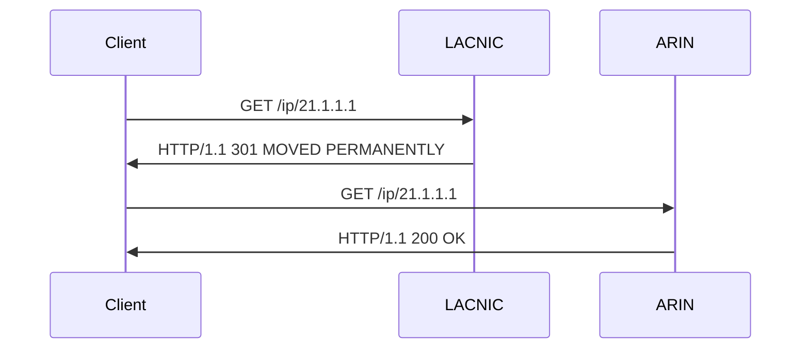
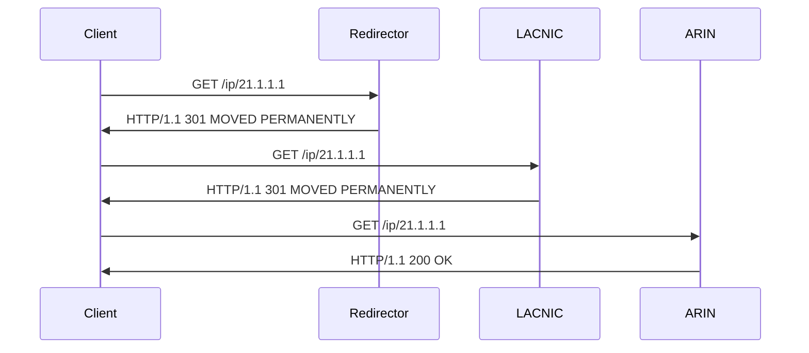

# Redirects

An [HTTP redirect is a type of response](../protocol/response_types.md#redirects) a client recieves from
a server when the server wishes the client to send the query elsewhere.

```svgbob
+---------+   "GET /ip/101.100.49.1"                               +---------+
|         |  --------------------------------------------------->  |         |
|         |                                                        |         |
| Client  |                                                        | Server  |
|         |  <---------------------------------------------------  |         |
|         |    "HTTP/1.1 301 MOVED PERMANENTLY"                    |         |
+---------+    "location: https://rdap.apnic.net/ip/101.100.49.1"  +---------+
```

This is used widely among the RIRs to supplement the normal [bootstrapping](iana.md) process
to accommodate Internet number resources that have been transfered from on RIR to another
(IANA does not record these transfers).

In the following example, a client uses bootstrapping to query LACNIC for 21.1.1.1, however
that resource has been transferred to ARIN therefore LACNIC issues a redirect.



The following example is from [Appendix C of RFC 7480](https://datatracker.ietf.org/doc/html/rfc7480#autoid-28).
However, that example also shows a redirector (an RDAP server performing redirects for clients) and is more
fully described as follows:


