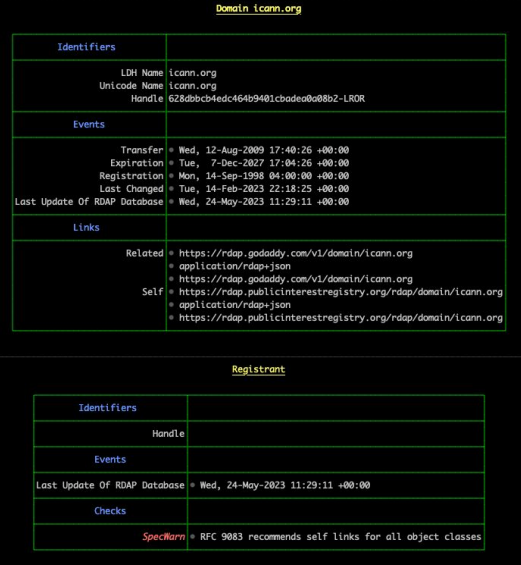
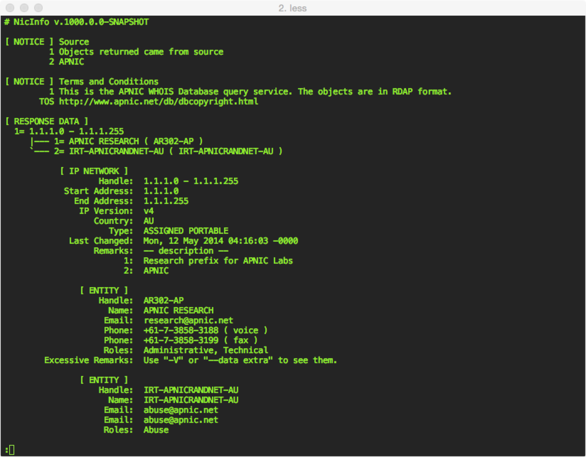
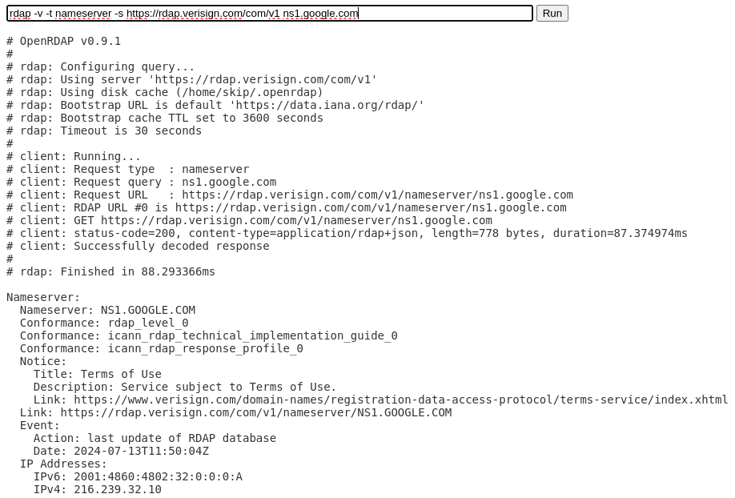
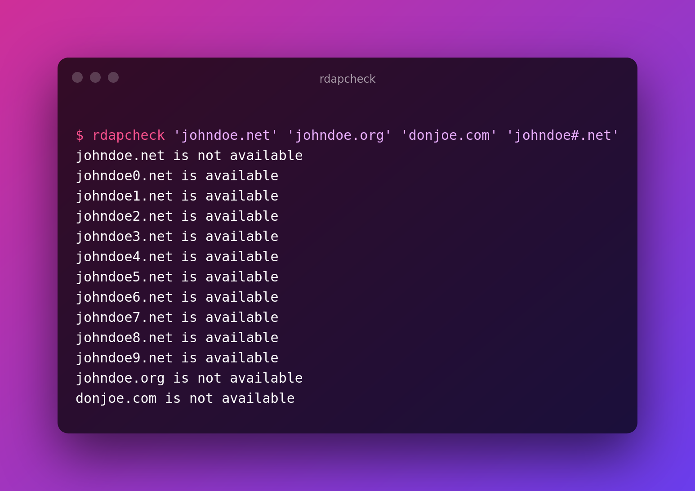
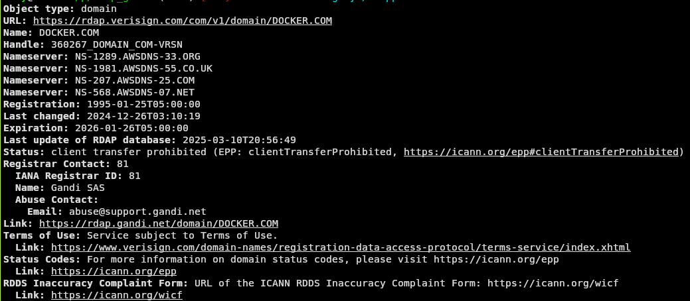

# CLI Applications

Command-Line Interface (CLI) clients have a heritage that goes back to original WHOIS,
which was accessed via clients run on Unix systems.

## ICANN RDAP CLI

From the GitHub Repository:

> This is a command-line interface (CLI) client for the Registration Data Access Protocol (RDAP) written and sponsored
> by the Internet Corporation for Assigned Names and Numbers [(ICANN)](https://www.icann.org). 
> RDAP is standard of the [IETF](https://ietf.org/), and extensions
> to RDAP are a current work activity of the IETF's [REGEXT working group](https://datatracker.ietf.org/wg/regext/documents/).
> More information on ICANN's role in RDAP can be found [here](https://www.icann.org/rdap).

* License: MIT, Apache License 2.0
* Repository: <https://github.com/icann/icann-rdap>
* Language: Rust
* Operating Systems: MacOS, Linux, Windows
* Related: [Client Library](libraries.md#icann-rdap-client-library), [Authoritative Server](../server_implementations/authoritative.md#icann-rdap-server), [Redirect Server](../server_implementations/redirect.md#icann-rdap-server)
* Features:
  * Caching
  * Bootstrapping
  * Output Paging



## IPWhois

> ipwhois_cli.py and ipwhois_utils_cli.py are command line interfaces for the ipwhois library. When using pip to install ipwhois, the CLI scripts are installed to your Python environment Scripts directory.
> 
> * ipwhois_cli.py has full ipwhois.py functionality.
> * ipwhois_utils_cli.py has full utils.py functionality.
> * The others (net.py, rdap.py, whois.py, nir.py, asn.py) will be included in a future release.

* License: BSD 2-Clause
* Repository: <https://github.com/secynic/ipwhois>
* Language: Python
* Operating Systems: MacOS, Linux, Windows
  Related: [Client Library](libraries.html#ipwhois)

## jrdap

> jrdap is a command-line RDAP client written in JavaScript. It has no dependencies beyond node.js.

* License: BSD 3-Clause
* Repository: <https://github.com/gbxyz/jrdap>
* Language: Javascript
* Operating Systems: MacOs, Linux, Windows

## NicInfo

From the GitHub Repository:

> NicInfo is a general purpose, command line Registry Data Access Protocol (RDAP) 
> client released under an open source, ISC derivative BSD style license. 
> RDAP is an HTTP-based RESTful protocol defined by the IETF as a replacement for Whois.

* License: ISC
* Repository: <https://github.com/arineng/nicinfo>
* Language: Ruby
* Operating Systems: MacOS, Linux, Windows
* Features:
  * Query type detection: it will attempt to determine what type of query is needed based on the supplied query value.
  * Plain text output: default output is a text version of the RDAP results.
  * JSON output: the RDAP JSON can be passed directly to a calling program for intergration with scripts with the ability to select specific JSON values.
  * Multiple output controls: the amount of text detail and process execution can be varied and sent to different files.
  * A Built-in cache: RDAP queries are cached.
  * Bootstrapping using the IANA bootstrap files or by using a bootstrap server.
  * Demonstration queries: a set of built-in queries and results are provided for demonstration purposes.



## OpenRDAP

From OpenRDAP.org:

> OpenRDAP is a command line client for the Registration Data Access Protocol, written in Go.

> RDAP is a replacement for WHOIS, which provides domain name & IP address registration information in JSON format over HTTP.

* License: MIT
* Repository: <https://github.com/openrdap/rdap>
* Language: Go
* Operating Systems: MacOS, Linux, Windows
* Features:
  * Output formats: text, JSON, WHOIS style
  * Query types supported:
    * ip
    * domain
    * autnum
    * nameserver
    * entity
    * help
    * url
    * domain-search
    * domain-search-by-nameserver
    * domain-search-by-nameserver-ip
    * nameserver-search
    * nameserver-search-by-ip
    * entity-search
    * entity-search-by-handle
  * Automatic server detection for ip/domain/autnum/entities
  * Object tags support
  * Bootstrap cache (optional, uses ~/.openrdap by default)
  * X.509 client authentication



### 20c RDAP

```
usage: rdap [-h] [--debug] [--home HOME] [--verbose] [--quiet] [--version] [--output-format OUTPUT_FORMAT] [--show-requests] [--parse] [--rir] [--write-bootstrap-data] query [query ...]

rdap

positional arguments:
  query

options:
  -h, --help            show this help message and exit
  --debug               enable extra debug output
  --home HOME           specify the home directory, by default will check in order: $RDAP_HOME, ./.rdap, /home/grizz/.rdap, /home/grizz/.config/rdap
  --verbose             enable more verbose output
  --quiet               no output at all
  --version             show program's version number and exit
  --output-format OUTPUT_FORMAT
                        output format (yaml, json, text)
  --show-requests       show all requests
  --parse               parse data into object before display
  --rir                 display rir
  --write-bootstrap-data
                        write bootstrap data for type (as query)  
```

* Package Information: <https://pypi.org/project/rdap/>
* Repository: <https://github.com/20c/rdap>
* License: Apache 2.0

### RDAP Cli

> This program is in charge of collecting all the relevant information related to a domain such as domain expiration date, nameservers, registration entity, domain registration date, if it is available to register or not.

* Package Information: <https://pypi.org/project/rdap-cli/>
* Repository: <https://github.com/alexeipopov95/rdap-cli>
* License: GPL 3.0

### RDAP Explorer

> Program focused on retrieving and parsing RDAP data and Geolocation for IPv4 addresses.

* Repository: <https://github.com/stifferdoroskevich/rdap_explorer>
* License: Unknown

### RDAP Check

> A simple library and command-line tool to check domain name availability in bulk using the RDAP protocol, a simple protocol meant to replace WHOIS.

* Package Information: <https://deno.land/x/rdapcheck@v0.1.1>
* Repository: <https://github.com/Gadiguibou/rdapcheck>
* Documentation: <https://deno.land/x/rdapcheck@v0.1.1?doc>
* License: AGPL-3.0
* Related: [Client Library](libraries.md#rdap-check)



### rdapper

> `rdapper` is a simple RDAP client. It uses [Net::RDAP](https://metacpan.org/pod/Net%3A%3ARDAP) to retrieve
> data about internet resources (domain names, IP addresses, and
> autonymous systems) and outputs the information in a human-readable
> format. If you want to consume this data in your own program you
> should use [Net::RDAP](https://metacpan.org/pod/Net%3A%3ARDAP) directly.
> 
> `rdapper` was originally conceived as a full RDAP client (back
> when the RDAP specification was still in draft form) but is now
> just a very thin front-end to [Net::RDAP](https://metacpan.org/pod/Net%3A%3ARDAP).

* Package Information: <https://metacpan.org/pod/App::rdapper>
* Repository: <https://github.com/gbxyz/rdapper>
* Documentation: <https://metacpan.org/pod/App::rdapper>
* License: Unknown Open Source
* Related: [Client Library](libraries.md#netrdap)


