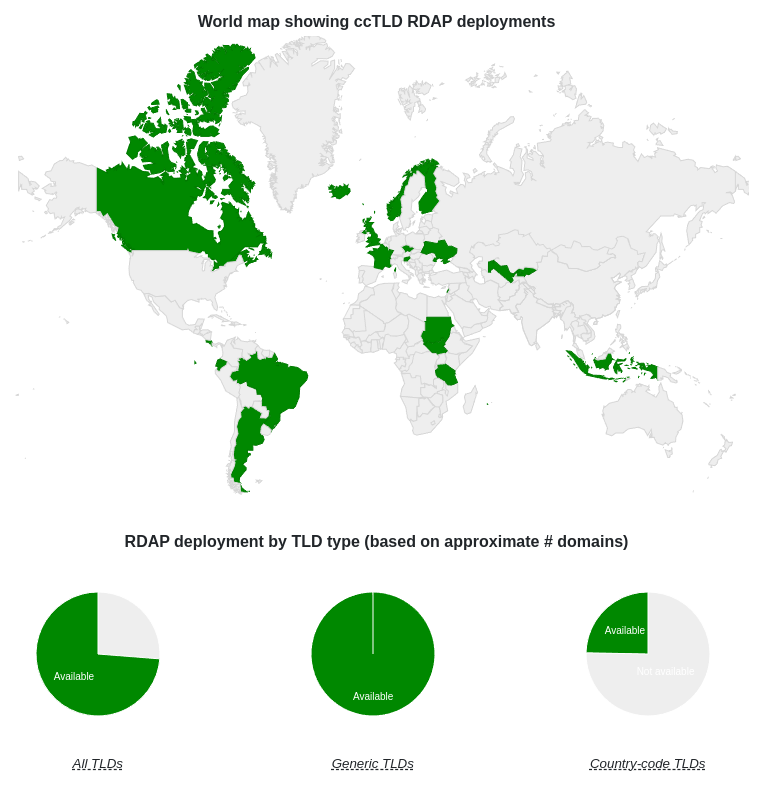
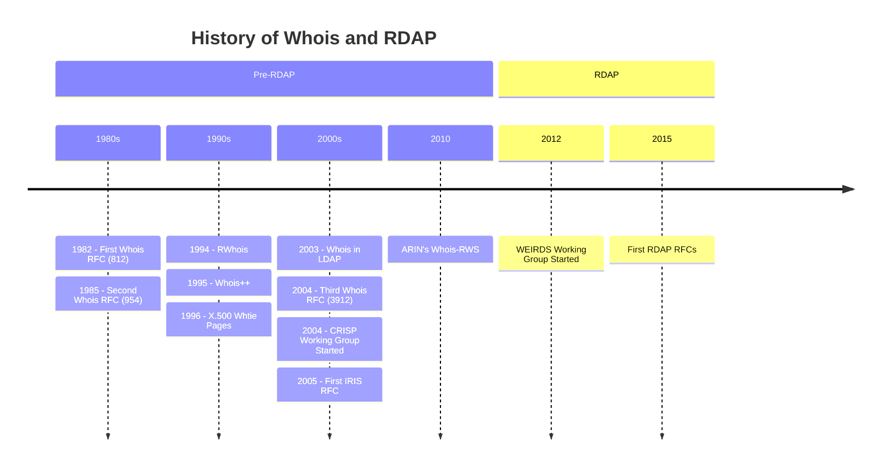

# History of RDAP

The Registry Data Access Protocol (RDAP) is the successor protocol to the Whois protocol. 
It was first ratified by the [IETF](/misc/glossary.md#ietf) in March 2015 by
their [WEIRDS](/misc/glossary.md#weirds) working group, and 
initial server and client implementations were released by the American Registry for
Internet Numbers ([ARIN](https://arin.net)), the 
Latin American and Caribbean Internet Address Registry ([LACNIC](https://lacnic.net)), 
and Asia Pacific Network Information Centre ([APNIC](https://apnic.net)) in June 2015.
The following year [the RIPE NCC](https://ripe.net) deployed their service followed by
[AfriNIC](https://afrinic.net).

Adoption by the [DNRs](/misc/glossary.md#dns) was much slower. 
[By 2018, only six registries](https://webmasters.stackexchange.com/questions/115588/why-is-rdap-so-poorly-supported-by-domain-name-registries)
had deployed RDAP services. However, in August 2019 [ICANN](/misc/glossary.md#icann) stipulated that
all [registries and registrars were to deploy RDAP.](https://www.icann.org/resources/pages/rdap-background-2018-08-31-en).

As of 2024, all 5 [RIRs](/misc/glossary.md#rir) have deployed RDAP, all [gTLDs](/misc/glossary.md#gtld) have deployed RDAP,
and 25% of [ccTLDs](/misc/glossary.md#cctld) have deployed RDAP according to the [RDAP Deployment Dashboard](https://deployment.rdap.org/).

*2024 RDAP deployment according to rdap.org*

## The Before Time

The [Whois protocol](https://en.wikipedia.org/wiki/WHOIS) has its origins in the very early days of computer networking and
predates both DNS and the Internet. Before RDAP, there were many attempts at creating a successor protocol.

In 1994, Network Solutions published a specification for Referral Whois (RWhois) as [Informational RFC 1714](https://www.rfc-editor.org/rfc/rfc1714).
Network Solutions was eventually purchased by VeriSign and then spun off into a domain registrar. RWhois is in limited use today
by [some Internet Service Providers in the ARIN region](https://www.arin.net/resources/registry/reassignments/rwhois/).

In 1995, the IETF published the Whois++ specification as a standards track protocol, [RFC 1835](https://datatracker.ietf.org/doc/html/rfc1835).
This protocol never found widespread deployment and is now considered Historic by the IETF.

In 1996, Sandia National Laboratory published an Informational RFC on using the X.500 Directory Access Protocol as a "white pages"
service for the United States: [RFC 1943](https://datatracker.ietf.org/doc/html/rfc1943).

And in December 2003, VeriSign published information on an experiment to use LDAP to replace Whois: [RFC 3663](https://www.rfc-editor.org/rfc/rfc3663.html).
It was this experiment that led VeriSign to the conclusion that a protocol specifically designed for the problem space of Internet registries
should be developed, and this led to the formation of the IETF's [Cross Registry Information Service Protocol (CRISP)](https://datatracker.ietf.org/wg/crisp/about/)
working group. 

The CRISP working group eventually produced the Internet Registry Information Service (IRIS) protocol, which used XML as its data serialization
form and defined multiple application-layer transports which could be signaled using S-NAPTR DNS records. The original application transport
was BEEP, but a simpler TCP-based protocol called XPC was also developed. IRIS also had a UDP-based transport called LWZ and defined a
lightweight domain availability schema called DCHK.

Ultimately, VeriSign never deployed IRIS. However, IRIS DCHK was used by DeNIC and Afnic. The [CRISP Requirements (RFC 3707)](https://datatracker.ietf.org/doc/rfc3707/)
were used as an input to the [WEIRDS](/misc/glossary.md#weirds) working group which produced the RDAP specifications.

In 2010, ARIN developed Whois-RWS (where RWS stands for RESTful Web Service), which is an HTTP-based system for retrieving Whois information.
With the experience of Whois-RWS and encouragement from ICANN staff to help pursue the [SSAC 051](https://itp.cdn.icann.org/en/files/security-and-stability-advisory-committee-ssac-reports/sac-051-en.pdf)
goals, the [WEIRDS BoF](https://www.ietf.org/proceedings/82/slides/weirds-0.pdf) was held in 2011 kicking off the [WEIRDS](/misc/glossary.md#weirds)
working group, which then created the RDAP specifications.

