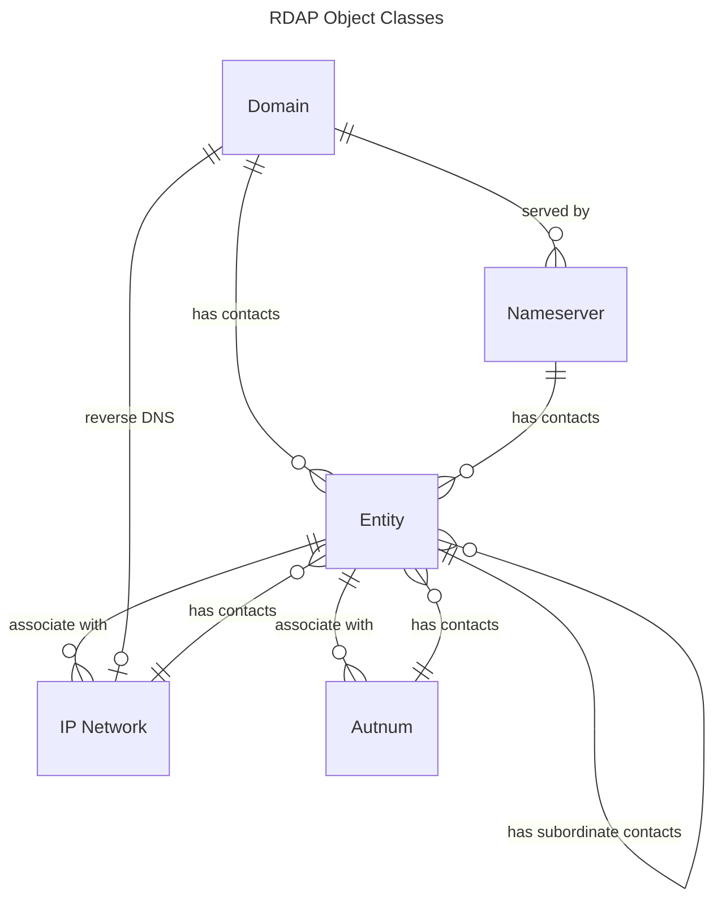
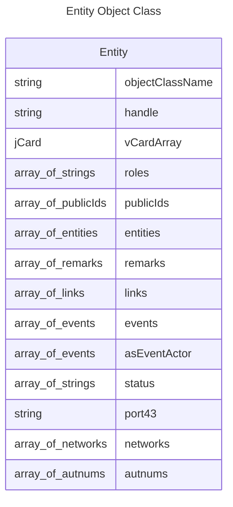

# JSON

```mermaid
---
title: RDAP Object Classes
---
erDiagram
    Entity ||--o{ Entity : "has subordinate contacts"
    Entity ||--o{ "IP Network": "associate with"
    Entity ||--o{ Autnum: "associate with"
    "IP Network" ||--o{ Entity : "has contacts"
    Autnum ||--o{ Entity : "has contacts"
    Domain ||--o{ Entity : "has contacts"
    Domain ||--o{ Nameserver : "served by"
    Domain ||--o| "IP Network" : "reverse DNS"
    Nameserver ||--o{ Entity : "has contacts"
```

```mermaid
---
title: Entity Object Class
---
erDiagram
    Entity {
      string  objectClassName
      string  handle
      jCard   vCardArray
      array_of_strings roles
      array_of_publicIds publicIds
      array_of_entities entities
      array_of_remarks remarks
      array_of_links links
      array_of_events events
      array_of_events asEventActor
      array_of_strings status
      string port43
      array_of_networks networks
      array_of_autnums  autnums
    }
```
