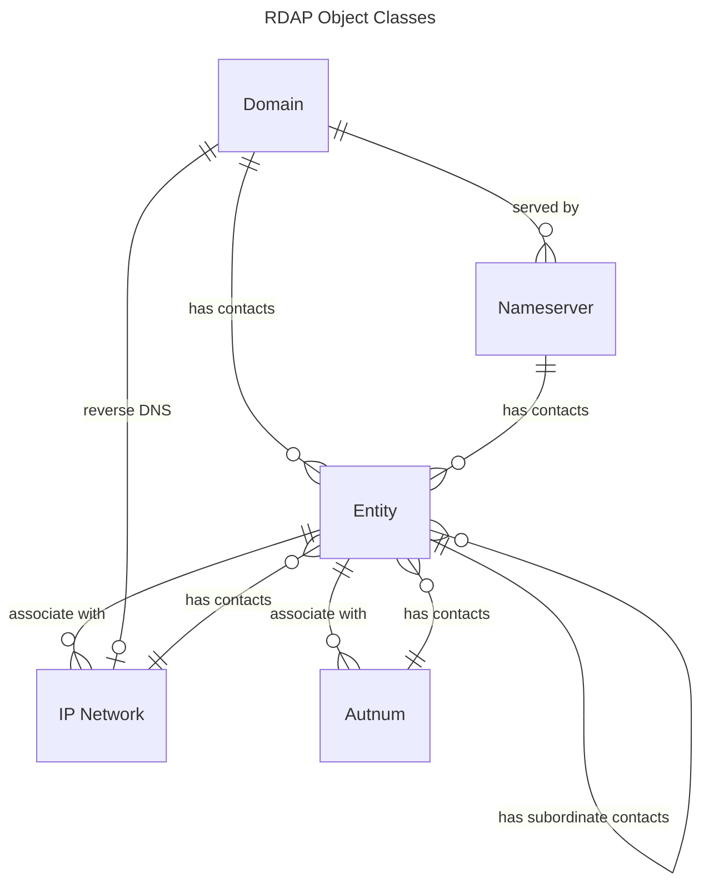

# Object Classes

In RDAP, the information being queried is an RDAP object, and the types or classes of those object are known
as object classes. They are defined in [RFC 9083](https://datatracker.ietf.org/doc/html/rfc9083).

RDAP defines 5 core object classes:
* [Entity](#entity) - a person, organization, group, etc...
* [Domain](#domain) - a DNS registration
* [Nameserver](#nameserver) - a nameserver (i.e. DNS host) registration
* [IP Network](#ip-network) - an IP address block registration
* [Autnum](#autnum) - an Autonomous System Number block registration

Object classes are composed of [the common data structures](common_data_types.md) as well as
other JSON structures specific to each. Additionally, all of the object classes can have
[child entities](#entity-children) and some can have [child ip networks](#ip-network-children),
[child autnums](#autnum-children), and [child nameservers](#nameserver-children).
The diagram below depicts these relationships.



## Entity

An entity represents a person, organization, role or group of people. In Whoi parlance, these are
often called "contacts".

The entity object class has the following JSON data structures:

| Name            | Value                                                                  |
|-----------------|------------------------------------------------------------------------|
|`objectClassName`|a common type defined [here](common_data_types.html#object-class-name)  |
|`handle`         |a registry-unique string identifier                                     |
|`vcardArray`     |see [jCard/vCard](jcard_and_vcard.html)                                 |
|`roles`          |an array of strings describing the role the entity fulfills with repect to the object that is its parent. These values must be registered in the IANA [RDAP JSON Values](https://www.iana.org/assignments/rdap-json-values/rdap-json-values.xhtml) registry.|
|`publicIds`      |a common type defined [here](common_data_types.html#public-ids)         |
|`entities`       |an array of objects as defined by this object class                     |
|`remarks`        |a common type defined [here](common_data_types.html#notices-and-remarks)|
|`links`          |a common type defined [here](common_data_types.html#the-links-array)    |
|`events`         |a common type defined [here](common_data_types.html#events)             |
|`asEventActor`   |an array of [events](common_data_types.html#events) without the `eventActor` JSON member. These are meant to define the entity as being the event actor. This is seldom used.|
|`status`         |a common type defined [here](common_data_types.html#status)             |
|`networks`       |an array of [IP networks](#ip_network)                                  |
|`autnums`        |an array of [autnums](#autnum)                                          |

The following is a contrived [example](entity-dnr.json) of an entity. Keep in mind that 
[`rdapConformance`](common_data_types.html#the-rdap-conformance-array) and
[`notices`](common_data_types.html#notices-and-remarks) are common to all
RDAP responses.

```json
{{#include entity-dnr.json}}
```

## Domain

## Nameserver

## IP Network

## Autnum

## Entity Children

## Nameserver Children

## IP Network Children

## Autnum Children
