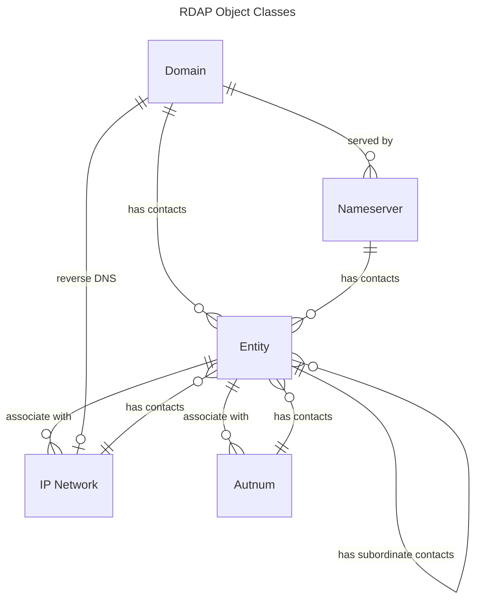

# Object Classes

```mermaid
---
title: RDAP Object Classes
---
erDiagram
    Entity ||--o{ Entity : "has subordinate contacts"
    Entity ||--o{ "IP Network": "associate with"
    Entity ||--o{ Autnum: "associate with"
    "IP Network" ||--o{ Entity : "has contacts"
    Autnum ||--o{ Entity : "has contacts"
    Domain ||--o{ Entity : "has contacts"
    Domain ||--o{ Nameserver : "served by"
    Domain ||--o| "IP Network" : "reverse DNS"
    Nameserver ||--o{ Entity : "has contacts"
```
