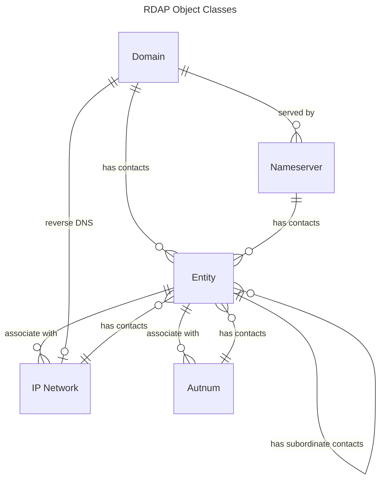

# Object Classes

In RDAP, the information being queried is an RDAP object, and the types or classes of those objects are known
as object classes. They are defined in [RFC 9083](https://datatracker.ietf.org/doc/html/rfc9083). Each
instance of an object class is **REQUIRED** to have the [`objectClassName`](common_data_structures.md#objectclassname)
attribute.

RDAP defines 5 core object classes:
* [Entity](#entity) - a person, organization, group, etc...
* [Domain](#domain) - a DNS registration
* [Nameserver](#nameserver) - a nameserver (i.e. DNS host) registration
* [IP Network](#ip-network) - an IP address block registration
* [Autnum](#autnum) - an Autonomous System Number block registration

Object classes are composed of [the common data structures](common_data_structures.md) as well as
other JSON structures specific to each. Many of these common structures are repeated in each object class, and
they generally have the following form:

```json
{
  "objectClassName" : "different for every object class",
  "handle" : "registry-unique-id",
  "status" : [ 
    // ... 
  ],
  "entities" : [
    // ...  
  ],
  "links" : [
    // ...
  ],
  "remarks" : [
    // ...
  ],
  "events" : [
    // ...
  ],
  "port43" : "whois.somewhere"

  // the structures specific to each object class
  // ...
}
```

When objects are returned as the top-most value of the response, such as in responses to
[lookups](index.md#lookups-and-searches), they would have the [`rdapConformance`](common_data_structures.md#rdapconformance)
array and optionally some [`notices`](common_data_structures.md#notices-and-remarks).

```json
{
  "rdapConformance" : [ "rdap_level_0" ],
  "notices" : [
    // ...  
  ],
  "objectClassName" : "different for every object class",
  "handle" : "registry-unique-id",

  // etc, ...
}
```

As hinted at above, all the object classes can have
[child entities](#entity-children). And some can have [child IP networks](#ip-network-children),
[child autnums](#autnum-children), and [child nameservers](#nameserver-children).
The diagram below depicts these relationships.



## Entity

An entity represents a person, organization, role or group of people. In Whois parlance, these are
often called "contacts".

The entity object class has the following JSON data structures:

| Name            | Value                                                                                                     |
|-----------------|-----------------------------------------------------------------------------------------------------------|
|`objectClassName`|(**REQUIRED**) must be "entity". See [`objectClassName`](common_data_structures.md#objectclassname)        |
|`handle`         |a registry-unique string identifier. See [`handle`](json.md#handle).                                       |
|`vcardArray`     |see [jCard/vCard](jcard_and_vcard.md)                                                                      |
|`roles`          |an array of strings describing the role the entity fulfills with repect to the object that is its parent. These values must be registered in the IANA [RDAP JSON Values](https://www.iana.org/assignments/rdap-json-values/rdap-json-values.xhtml) registry.|
|`publicIds`      |a common type defined [here](common_data_structures.md#publicids)                                          |
|`entities`       |an array of objects as defined by this object class. See [entity children](#entity-children).              |
|`remarks`        |a common type defined [here](common_data_structures.md#notices-and-remarks)                                |
|`links`          |a common type defined [here](common_data_structures.md#links)                                              |
|`events`         |a common type defined [here](common_data_structures.md#events)                                             |
|`asEventActor`   |an array of [events](common_data_structures.md#events) without the `eventActor` JSON member. These are meant to define the entity as being the event actor. This is seldom used.|
|`status`         |a common type defined [here](common_data_structures.md#status)                                             |
|`port43`         |a common type defined [here](common_data_structures.md#port43)                                             |
|`networks`       |an array of [IP networks](#ip_network). See [IP network children](#ip-network-children).                   |
|`autnums`        |an array of [autnums](#autnum). See [autnum children](#autnum-children).                                    |

The following is a contrived [example](entity-dnr.json) of an entity. Keep in mind that 
[`rdapConformance`](common_data_structures.md#rdapconformance) and
[`notices`](common_data_structures.md#notices-and-remarks) are common to all
RDAP responses.

```json
{{#include entity-dnr.json}}
```

## Domain

A domain object represents a domain registration. This is the most complicated of all the
object classes.

The domain object class has the following JSON data structures:

| Name            | Value                                                                                              |
|-----------------|----------------------------------------------------------------------------------------------------|
|`objectClassName`|(**REQUIRED**) must be "domain". See [`objectClassName`](common_data_structures.md#objectclassname).|
|`handle`         |a registry-unique string identifier. See [`handle`](json.md#handle).                                |
|`ldhName`        |a letters-digits-hyphens (ldh, aka ASCII-only) domain name.                                         |
|`unicodeName`    |the U-label version of an Internationalized Domain Name (IDN).                                      |
|`variants`       |set of variant IDNs for this domain. See [`variants`](#variants).                                   |
|`nameservers`    |an array of nameserver objects. See [nameserver children](#nameserver-children).                    |
|`secureDNS`      |DNSSEC information. See [DNSSEC data](#dnssec).                                                     |
|`publicIds`      |a common type defined [here](common_data_structures.md#publicids)                                   |
|`entities`       |an array of entity objects. See [entity children](#entity-children).                                |
|`remarks`        |a common type defined [here](common_data_structures.md#notices-and-remarks)                         |
|`links`          |a common type defined [here](common_data_structures.md#links)                                       |
|`events`         |a common type defined [here](common_data_structures.md#events)                                      |
|`status`         |a common type defined [here](common_data_structures.md#status)                                      |
|`port43`         |a common type defined [here](common_data_structures.md#port43)                                      |
|`network`        |a single instance of [IP networks](#ip_network).                                                    |

The following is a contrived [example](domain-dnr.json) of a domain. Keep in mind that 
[`rdapConformance`](common_data_structures.md#rdapconformance) is common to all RDAP responses.

```json
{{#include domain-dnr.json}}
```

### Variants

The `variants` structure describes domains that are internationalized variants of the domain registration. This
is an array of objects, each with the following members:


| Name            | Value                                                                                        |
|-----------------|----------------------------------------------------------------------------------------------|
|`relation`       |array of strings, each a "domain variant relation" from the [RDAP JSON Values IANA Registry](https://www.iana.org/assignments/rdap-json-values/rdap-json-values.xhtml).|
|`idnTable`       |the name of the [IDN table](https://www.iana.org/domains/idn-tables).                         |
|`variantNames`   |array of objects in the form `{"ldhName": "xn--fo-5ja.example", "unicodeName": "fóo.example"}`|

The following excerpt is an example from RFC 9083:

```json
"variants" :
[
  {
    "relation" : [ "registered", "conjoined" ],
    "variantNames" :
    [
      {
        "ldhName" : "xn--fo-cka.example",
        "unicodeName" : "fõo.example"
      },
      {
        "ldhName" : "xn--fo-fka.example",
        "unicodeName" : "föo.example"
      }
    ]
  },
  {
    "relation" : [ "unregistered", "registration restricted" ],
    "idnTable": ".EXAMPLE Swedish",
    "variantNames" :
    [
      {
        "ldhName": "xn--fo-8ja.example",
        "unicodeName" : "fôo.example"
      }
    ]
  }
]
```

### DNSSEC

The `secureDNS` structure describes the information about the domain's DNS Security Extensions (DNSSEC). The topic
of DNSSEC is broad. For understanding the meaning of the fields of this structure, readers should consult
[RFC 4034](https://datatracker.ietf.org/doc/html/rfc4034).

One interesting aspect of the `secureDNS` information is that RDAP can convey their updates separately from the
domain name itself using the [`links`](common_data_structures.md#links) and [`events`](common_data_structures.md#events).

| Name             | Value                                                                                         |
|------------------|-----------------------------------------------------------------------------------------------|
|`zoneSigned`      |`true` if the domain's zone is signed, otherwise `false`.                                      |
|`delegationSigned`|`true` if the domain's parent zone has signed the delegation to this domain, otherwise `false`.|
|`dsData`          |an array of objects describing Delegation Signer objects. See [below](#dsdata).                |
|`keyData`         |an array of objects describing DNS Key objects. See [below](#keydata).                         |

#### dsData
| Name             | Value                                                                                         |
|------------------|-----------------------------------------------------------------------------------------------|
|`keyTag`          |the integer of the key tag field of a DS record.                                               |
|`algorithm`       |the integer of the algorithm field of a DS record.                                             |
|`digest`          |string containing the hexadecimal digest of the DS record.                                     |
|`digestType`      |the integer of the digest type of DS record.                                                   |
|`links`           |a common type defined [here](common_data_structures.md#links)                                  |
|`events`          |a common type defined [here](common_data_structures.md#events)                                 |

#### keyData
| Name             | Value                                                                                         |
|------------------|-----------------------------------------------------------------------------------------------|
|`flag`            |the integer of the flag field of a DNSKEY record.                                              |
|`protocol`        |the integer of the protocol field of a DNSKEY record.                                          |
|`publicKey`       |string containing the hexadecimal digest of a DNSKEY record public key.                        |
|`algorithm`       |the integer of the algorithm field of a DNSKEY record.                                         |
|`links`           |a common type defined [here](common_data_structures.md#links)                                  |
|`events`          |a common type defined [here](common_data_structures.md#events)                                 |

#### `secureDNS` example

```json
"secureDNS" : {
  "delegationSigned" : true,
  "dsData" : [
    {
      "algorithm" : 13,
      "digest" : "B9BEC0EAC0F064929C8586DB185537787015EC3A48F0894BEA74DEEA452F3060",
      "digestType" : 2,
      "events" : [
        {
          "eventAction" : "registration",
          "eventDate" : "2018-03-27T20:09:08Z"
        },
        {
          "eventAction" : "last changed",
          "eventDate" : "2022-04-27T20:19:46Z"
        }
      ],
      "keyTag" : 47828
    }
  ]
}
```

### Nameserver Children

Registries can differ in how they model nameservers, often referred to as "hosts". None
of the [RIRs](../misc/glossary.md#rir) allow direct registration of nameservers as they
must be carefully managed to compose reverse DNS. Some [DNRs](../misc/glossary.md#dnr)
do allow direct registration of nameservers and some do not.

When a registry treats nameservers a "firs-class" objects (objects with a registration
distinct from other objects), this is often called the "host object" model. Otherwise,
this is often called the "host attribute" model.

The [example](domain-dnr.json) given [above](#domain) shows a "host object" model.
The "host attribute" model is usually much simpler, where the nameservers do not have
a `handle` or other meta-data separate from the domain. The following is an example.

```json
"nameserver" : [
  {
    "objectClassName" : "nameserver",
    "ldhName" : "ns1.example.com"
  },
  {
    "objectClassName" : "nameserver",
    "ldhName" : "ns2.example.com"
  }
]
```

Sometimes they may include the IP addresses of the nameservers.

```json
"nameserver" : [
  {
    "objectClassName" : "nameserver",
    "ldhName" : "ns1.example.com",
    "ipAddresses" :
    {
      "v6": [ "2001:db8::123", "2001:db8::124" ],
      "v4": [ "192.0.2.1", "192.0.2.2" ]
    }
  },
  {
    "objectClassName" : "nameserver",
    "ldhName" : "ns2.example.com",
    "ipAddresses" :
    {
      "v6" : [ "2001:db8::125", "2001:db8::126" ],
      "v4" : [ "192.0.2.3", "192.0.2.4" ]
    },
  }
]
```

## Nameserver

The nameserver object class represents nameservers, or hosts as they are often called.
They are most commonly children of [domain](#domain) objects (see [above](#namerserver-children)),
but can be registerable objects as well.

The nameserver object class has the following structures:

| Name            | Value                                                                                                    |
|-----------------|----------------------------------------------------------------------------------------------------------|
|`objectClassName`|(**REQUIRED**) must be "nameserver". See [`objectClassName`](common_data_structures.md#objectclassname).  |
|`handle`         |a registry-unique string identifier. See [`handle`](json.md#handle).                                      |
|`ldhName`        |a letters-digits-hyphens (ldh, aka ASCII-only) fully-qualified domain name of the nameserver.             |
|`unicodeName`    |the U-label version of Internationalized Domain Name (IDN) of the nameserver.                             |
|`ipAddresses`    |an array of objects, each with a `v4` and `v6` string array containing the IP addresses of the nameserver.|
|`entities`       |an array of entity objects. See [entity children](#entity-children).                                      |
|`remarks`        |a common type defined [here](common_data_structures.md#notices-and-remarks)                               |
|`links`          |a common type defined [here](common_data_structures.md#links)                                             |
|`events`         |a common type defined [here](common_data_structures.md#events)                                            |
|`status`         |a common type defined [here](common_data_structures.md#status)                                            |
|`port43`         |a common type defined [here](common_data_structures.md#port43)                                            |

The following is a contrived [example](ns.json) of a nameserver. Keep in mind that 
[`rdapConformance`](common_data_structures.md#rdapconformance) is common to all RDAP responses.

```json
{{#include ns.json}}
```

## IP Network

The "ip network" object class represents the registration of an IP address block. As not all [INRRs](../glossary.md#inrr) require
registrations on [CIDR](https://datatracker.ietf.org/doc/html/rfc4632) block boundaries, the IP address object defines the
registration with a `startAddress` and `endAddress`.

This object class has the following structures:

| Name            | Value                                                                                                    |
|-----------------|----------------------------------------------------------------------------------------------------------|
|`objectClassName`|(**REQUIRED**) must be "ip network". See [`objectClassName`](common_data_structures.md#objectclassname).  |
|`handle`         |a registry-unique string identifier. See [`handle`](json.md#handle).                                      |
|`startAddress`   |a string containing the start IP address.                                                                 |
|`endAddress`     |a string containing the end IP address.                                                                   |
|`ipVersion`      |a string of either "v4" or "v6" denoting the IP address family version.                                   |
|`name`           |a name for the registration usually given by the registration holder.                                     |
|`type`           |a string containing an [RIR](../misc/glossary.md#rir) classification of the registration.                 |
|`country`        |a string with the ISO 3166-2 Alpha2 country code where the network originates traffic.                    |
|`parentHandle`   |the handle of the parent network.                                                                         |
|`entities`       |an array of entity objects. See [entity children](#entity-children).                                      |
|`remarks`        |a common type defined [here](common_data_structures.md#notices-and-remarks)                               |
|`links`          |a common type defined [here](common_data_structures.md#links)                                             |
|`events`         |a common type defined [here](common_data_structures.md#events)                                            |
|`status`         |a common type defined [here](common_data_structures.md#status)                                            |
|`port43`         |a common type defined [here](common_data_structures.md#port43)                                            |

The following is an [example](ip-network.json) of an IP network taken from [APNIC](https://apnic.net) and edited for
educational purposes. Keep in mind that 
[`rdapConformance`](common_data_structures.md#rdapconformance) and [`notices`](commond_data_structures.md#notices) are 
common to all RDAP responses.

```json
{{#include ip-network.json}}
```

## Autnum

The "autnum" object class represents a registration of a block of [Autonomous System Numbers (ASNs)](https://datatracker.ietf.org/doc/html/rfc1930).
To some, the fact that they are represented as a block instead of a single ASN may seem odd as it is rare that a network
is allocated more than one at a time. However, both the [IANA](../misc/glossary.md#iana) and [ARIN](https://arin.net) allocate them
in blocks, though this is rare for ARIN.

Similar to the [IP Network](#ip-network) object class, these blocks are represented with a `startNum` and a `endNum`.

It has the following structures:

| Name            | Value                                                                                                    |
|-----------------|----------------------------------------------------------------------------------------------------------|
|`objectClassName`|(**REQUIRED**) must be "autnum". See [`objectClassName`](common_data_structures.md#objectclassname).      |
|`handle`         |a registry-unique string identifier. See [`handle`](json.md#handle).                                      |
|`startNum`       |a string containing the starting ASN.                                                                     |
|`endAddress`     |a string containing the ending ASN.                                                                       |
|`name`           |a name for the registration usually given by the registration holder.                                     |
|`type`           |a string containing an [RIR](../misc/glossary.md#rir) classification of the registration.                 |
|`country`        |a string with the ISO 3166-2 Alpha2 country code where the network originates traffic.                    |
|`entities`       |an array of entity objects. See [entity children](#entity-children).                                      |
|`remarks`        |a common type defined [here](common_data_structures.md#notices-and-remarks)                               |
|`links`          |a common type defined [here](common_data_structures.md#links)                                             |
|`events`         |a common type defined [here](common_data_structures.md#events)                                            |
|`status`         |a common type defined [here](common_data_structures.md#status)                                            |
|`port43`         |a common type defined [here](common_data_structures.md#port43)                                            |

The following is an [example](asn.json) of an autnum taken from [APNIC](https://apnic.net) and edited for
educational purposes. Keep in mind that 
[`rdapConformance`](common_data_structures.md#rdapconformance) and [`notices`](commond_data_structures.md#notices) are 
common to all RDAP responses.

```json
{{#include asn.json}}
```

## Entity Children

As noted above, all objects can have a `entities` value that is an array of [entities](#entity), including an entity.
This means that [entities](#entity) can be nested, which is useful when showing the relationship between entities.

```json
{
  // ...
  "entities" : [
    {
      "objectClassName" : "entity",
      "handle" : "big-company-1",
      "roles" : [ "registrant" ],
      // ...
      "entities" : [
        {
          "objectClassName" : "entity",
          "handle" : "employee-1",
          "roles" : [ "technical" ]
          // ...
        }
      ]
    }  
  ]
}
```

## IP Network Children

[Entities](#entity) may have multiple [IP network](#ip-network) children. This is used to allow [RIR](../misc/glossary.md#rir)
members to enumerate the number of networks they hold.


```json
{
  "objectClassName" : "entity",
  "networks" : [
    {
      "objectClassName" : "ip network",
      "handle" : "net1"
      // ...
    },
    {
      "objectClassName" : "ip network",
      "handle" : "net2"
      // ...
    }  
  ]

  // ...
}
```

## Autnum Children

Similarly, [entities](#entity) may also have [autnum](#autnum) children. Again, this is used to allow [RIR](../misc/glossary.md#rir)
members to enumerate the number of autnum registrations they hold.

```json
{
  "objectClassName" : "entity",
  "autnums" : [
    {
      "objectClassName" : "autnum",
      "handle" : "asn-1-1"
      // ...
    },
    {
      "objectClassName" : "autnum",
      "handle" : "asn-2-1"
      // ...
    }  
  ]

  // ...
}
```
