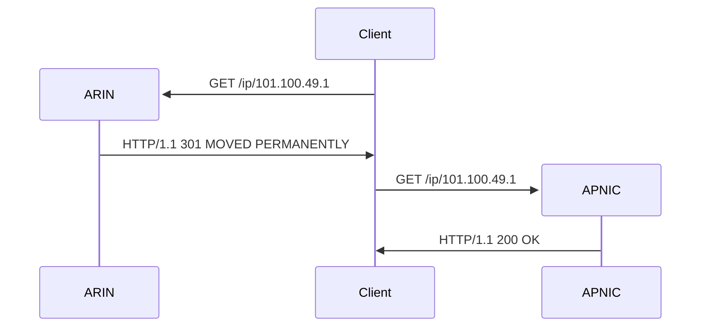

# Response Types

[Section 5 of RFC 7480](https://datatracker.ietf.org/doc/html/rfc7480#section-5) outlines the various types of responses
a server might send. These types are categorized by the HTTP status code sent back to a client. This RFC describes some
specific scenarios but does not preclude other status codes as defined by HTTP. 

Much of this may seem obvious today, but whent the RFC was being specified there were many questions in the IETF
as to how REST-ful services were to work, especially given a somewhat known operational model for Whois.
Simply put, the descriptions in this RFC are provided to help implementers bridge the gap from Whois to RDAP.

## Positive Answers

A positive answer is one that includes a response containing the information being querying and uses the 200 (OK) status code.

```svgbob
+----------------+   "GET /ip/101.100.49.1"                    +----------------+
|                |  ---------------------------------------->  |                |
|                |                                             |                |
| Client         |                                             | Server         |
|                |  <----------------------------------------  |                |
|                |                         "HTTP/1.1 200 OK"   |                |
+----------------+                                             +----------------+
```

## Not Found

If a client queries for a registration that the server cannot provide, the response code is 404 (NOT FOUND).

```svgbob
+----------------+   "GET /ip/127.0.0.1"                       +----------------+
|                |  ---------------------------------------->  |                |
|                |                                             |                |
| Client         |                                             | Server         |
|                |  <----------------------------------------  |                |
|                |                  "HTTP/1.1 404 NOT FOUND"   |                |
+----------------+                                             +----------------+
```

## Rate Limiting

Because RDAP servers (and Whois server) are often the target of data mining, the [RFC 7480](https://datatracker.ietf.org/doc/html/rfc7480#section-5)
does describe using the 429 (TOO MANY REQUESTS) status code. While clients should be capable of either
back-off retries or bubbling up this error to the user, in practice servers that are under load don't
respond at all.

```svgbob
+----------------+   "GET /ip/101.100.49.1"                    +----------------+
|                |  ---------------------------------------->  |                |
|                |                                             |                |
| Client         |                                             | Server         |
|                |  <----------------------------------------  |                |
|                |          "HTTP/1.1 429 TOO MANY REQUESTS"   |                |
+----------------+                                             +----------------+
```

## Redirects

There are many cases in which an RDAP server returns a redirect, especially the [RIRs](misc/glossary.md#rir).
[RFC 7480](https://datatracker.ietf.org/doc/html/rfc7480#section-5) does not specify which is
appropriate to use leaving that decision up to the server operator. The RFC simply lists the availabe
types of redirects:

* 301 (MOVED PERMANENTLY)
* 302 (FOUND)
* 303 (SEE OTHER)
* 307 (TEMPORARY REDIRECT)

```svgbob
+---------+   "GET /ip/101.100.49.1"                               +---------+
|         |  --------------------------------------------------->  |         |
|         |                                                        |         |
| Client  |                                                        | Server  |
|         |  <---------------------------------------------------  |         |
|         |    "HTTP/1.1 301 MOVED PERMANENTLY"                    |         |
+---------+    "location: https://rdap.apnic.net/ip/101.100.49.1"  +---------+
```

Clients should be prepared to handle all of them, and any RDAP client directly processing redirects
(i.e. not relying on an HTTP library to follow redirects automatically) needs to have logic handle
redirect loops.

Typically, redirection only has one or two sequences.


